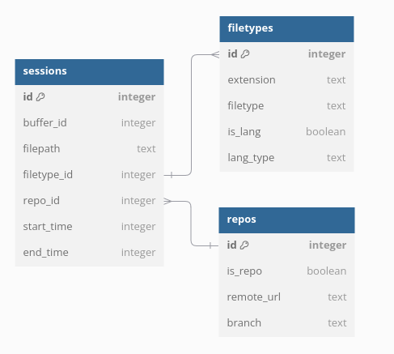

# ⚠️ 
- Plugin is still in development, so there might be some bugs. If you find any, create an issue

# CODETRACKER.NVIM ⏱

#### Simple plugin for tracking your coding records using sqlite and Nvim 

## What is codetracker ?
📊🤖 Automatic Time Tracking for Neovim

- ⏱️ Effortlessly track your time spent in Neovim
- 📁 Monitor time spent in each buffer and collect data on edited files (including git repositories)
- 🗄️ Store all information in a local SQLite database for easy querying and analysis
- 🔍 Gain insights into your coding patterns and productivity

This plugin automatically captures your Neovim usage, allowing you to focus on coding while it gathers valuable data. With a local SQLite database, you can perform custom queries to extract the insights that matter most to you.

- NOTE: The plugin is primarily designed to collect and store data into a database. I left data retrieval and analysis to the user because each user may be interested in different data insights.
- HOWEVER: I'm planning to add commands that will provide some basic and quick analysis inside Neovim!


# Installation

## Dependencies

### Linux (Ubuntu)
codetracker.nvim is using lsqlite3 lua library
 - you need to have sqlite3 installed on your system
 - you need lsqlite3 lua library installed on your system (you can use luarocks for that)
 ```bash
sudo apt-get update
sudo apt-get install luarocks
```
- check that you have sqlite3 installed on your system
```bash
sqlite3 --version
# if not then:
sudo apt-get install -y sqlite3 libsqlite3-dev
```
NOTE: if you have already installed sqlite3 and you are having problem with installing luarocks *(Error: no file sqlite3.h at usr/local/include)*, be sure that you have  **libsqlite3-dev** package installed at your system

- installing lsqlite3 using luarocks:
```bash
luarocks install lsqlite3
```

## Installing plugin using lazy.nvim
- you can use [lazy.nvim](https://github.com/folke/lazy.nvim) to load plugin, add this to your init.lua file
```lua

require("lazy").setup({
    {
        "vsinagl/codetracker.nvim", lazy = false,
        config = function()
            require("codetracker").setup()
        end,
    },
})

```

## Installing plugin using packer.nvim

``` lua
use {
  'vsinagl/codetracker.nvim',
  config = function()
    require('codetracker').setup()
  end
}
```

# Database
Plugin provide automatic way of storing data into sqlite database. In current plugin state, I left querying database and data retrieval to the user.

## Where is my database stored ?
By default, your database is stored inside your plugin directory inside lua/ folder.
If you are using lazy.nvim for example, you can find your plugin at:
```
~/.local/share/nvim/codetracker.nvim
and your database will be stored at:
~/.local/share/nvim/codetracker.nvim/lua/codetracker.db

```

## How does the database look like ?
Database consists of 4 tables (**buff_sessions**, **filetypes**, **repos**, projects), project tables is not used yet.


## Some queries examples
Overview of all sessions, sorted by newest to latest:
```sql
select
	t1.buffer_id,
      t1.filepath,
      t2.extension,
      t3.remote_url,
      datetime(start_time, 'unixepoch') as 'start_time', strftime('%H:%M:%S', end_time - start_time, 'unixepoch') as 'duration'
from sessions as t1 
	inner join filetypes as t2 on t1.filetype_id = t2.id
	inner join repos as t3 on t1.repo_id = t3.id
order by start_time desc;
```

How much coding you did each day:
```sql
select datum, strftime('%H:%M:%S', SUM(end_time - start_time), 'unixepoch')
AS total_time
from (select *, date(start_time,'unixepoch') as 'datum' from sessions)
group by datum
order by datum desc;
```

# Like it ? Give it a ⭐️


